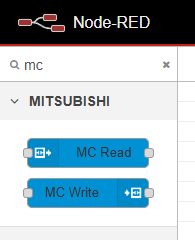
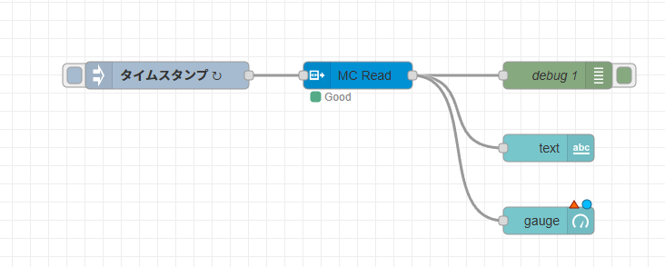

# 生産管理システム実習

## 目的: (PLC の機能をつかって) 製造指示、実績収集、生産設備状態監視の基礎技術を学び、クラウド連携を含む簡易生産管理システムを構築する。

## 生産管理システムとは

Wikipedia:
> 生産管理（せいさんかんり、英: production control）とは、経営計画あるいは販売計画に従って生産活動を計画し、
> 組織し、統制する総合的な管理活動のこと。その内容は、生産計画、生産組織および、生産統制である。これらのうち、
> 一つないし二つだけの管理は、生産管理の部分管理とみなされる。 

経営計画や販売計画はスコープの範囲外です。また「生産組織」（どういう組織にするか）や「生産統制」（どういうルールにするか）というのは、経営に依存するため、これもスコープの範囲外です。

授業で扱うのは、計画にしたがってきちんと製品が生産されているかを管理するシステムです。
FA システムに対して

- 製造指示をして、
- 実績を収集して、
- 設備の状態を監視 (モニタリング)

するシステムを目指します。

 (ネットワークを介して) PLC によって構築された製造ラインに指示を出して、それがきちんと実行されているかをわかるように (可視化、見え
る化) しよう、ということです。

### 生産管理システムの主な機能と特徴

- 生産計画とスケジューリング
- 生産作業の管理と監視
- 品質管理と検査
- 資材や在庫の管理
- 作業指示と文書管理
- リアルタイムなデータ分析と改善

### メリット
- 生産プロセスの効率化と最適化
- 品質向上と品質保証
- 資材の適切な管理と在庫最適化
- 作業効率の向上と生産性の向上

### 製造業への重要性
- 生産活動の効率化・品質向上の鍵
- 迅速なリアルタイムデータに基づく意思決定
- 競争力の維持・強化

## 市販の生産管理システム例

https://hp.adap.kke.co.jp/adaplp/


## PLC から得られる情報

- 制御プログラムで判断する稼働状態
- 制御プログラム内部の変数（モード、パラメータ、エラーコード）
- 接続している各種アクチュエータへの出力信号
- 接続している各種センサからの入力信号（On/Off、測定値）

### 入力情報（デジタル/アナログ）

- デジタル入力（DI）: スイッチ、センサー、リレーなどからのON/OFF信号やデジタル状態の情報。
- アナログ入力（AI）: 温度、圧力、位置などのアナログ信号を変換して受信する情報。

### 出力情報（デジタル/アナログ）:
- デジタル出力（DO）: モーター、バルブ、ランプなどのON/OFF制御信号。
- アナログ出力（AO）: モーターの速度、バルブの開度など、連続的なアナログ信号の制御。

### 制御信号:
- プログラムに基づいて生成される信号やタイミング情報。例えば、制御信号を使ってモーターの回転速度を制御する。

### アラームと異常情報:
- センサーの異常、プロセスの異常、機器の故障など、異常状態を示す情報。これらはアラームとして通知。

### タイミング情報:
- 特定のイベントの発生やプロセスのタイミング情報。例えば、生産ラインのスタート/ストップタイミングなど。

### プロセスデータ:
- 生産速度、生産量、温度プロファイル、圧力曲線など、プロセス全体のデータ。

### 制御プログラムの実行状態:
- PLC内で実行されている制御プログラムの状態やステップ情報。

# 実習で使用する環境

## 三菱製 PLC 
はじめにレジスタに値を書き込む簡単なプログラムをセットアップし、そのレジスタをネットワーク越しに Node-Red (Rasberrry Pi) から読み取ります。また書き込めるかを確認します。
授業の後半ではワーク製造ラインに対して同様のことができるか、やってみます。

## RaspberryPi 3 modelB+
- https://www.raspberrypi.com/products/raspberry-pi-3-model-b-plus/

Raspberry Pi を使います。

### Node-Red

ブロックをつなげるだけでオンラインサービスが作れるツール（なかなかわかりにくい。使ってみるのが早い）。
Node-Red は無料で利用でき、Windows や Mac でも動作しますが、管理者権限が必要なケースもあるため、今回は Raspberry Pi 上で実行します。

- https://nodered.org/
- 日本のコミュニティ
  - https://nodered.jp/

## Google Firebird

グーグルのクラウドサービス。無料で使えるデータベースです。

## ネットワークカメラ

(余裕があれば) 応用編として、 Node-Red からネットワークカメラを操作して、ラインの状態を外部からモニタリングできるようにしてみます。

# RaspberryPi セットアップ

- スピード重視のため wifi でなく有線でつなぎましょう。

## ソフトウェアを最新の状態にする

```shell
$ apt-get update  (管理データベースを最新にする)
$ apt-get upgrade (管理データベースにしたがってソフトウェアを最新にする)
<再起動>
```
## IP アドレスを固定する

Raspberry Pi に固定 IP アドレスを割り当てます。

/etc/dhcpcd.conf を編集します。この３行をファイルの最後に追加してください。
/etc/dhcpcd.conf の編集には管理者権限が必要です。

ip_address は各自が使用するアドレスに変更します。`/24` を忘れないように。

先生の /etc/dhcpcd.conf
```shell
interface eth0
static ip_address=192.168.30.221/24
static routers=192.168.30.254
static domain_name_servers=8.8.8.8
```

### IP アドレスを確認

再起動し IP アドレスが変わっているか確認します。
ip コマンドを使って RaspberryPi の IP アドレスを確認する。有線 (Ethernet) は 2

以下の例では 192.168.30.221。

```shell
plcuser@kubota-pi:~ $ ip address
1: lo: <LOOPBACK,UP,LOWER_UP> mtu 65536 qdisc noqueue state UNKNOWN group default qlen 1000
    link/loopback 00:00:00:00:00:00 brd 00:00:00:00:00:00
    inet 127.0.0.1/8 scope host lo
       valid_lft forever preferred_lft forever
    inet6 ::1/128 scope host 
       valid_lft forever preferred_lft forever
2: eth0: <BROADCAST,MULTICAST,UP,LOWER_UP> mtu 1500 qdisc pfifo_fast state UP group default qlen 1000
    link/ether b8:27:eb:02:ce:df brd ff:ff:ff:ff:ff:ff
    inet 192.168.30.221/24 brd 192.168.30.255 scope global noprefixroute eth0
       valid_lft forever preferred_lft forever
    inet6 fe80::f503:9d2:5faf:c0a6/64 scope link 
       valid_lft forever preferred_lft forever
3: wlan0: <NO-CARRIER,BROADCAST,MULTICAST,UP> mtu 1500 qdisc pfifo_fast state DOWN group default qlen 1000
    link/ether b8:27:eb:57:9b:8a brd ff:ff:ff:ff:ff:ff

```

## Node-Red のセットアップ

Raspberry Pi にゲートウェイ機能 (PLC など生産設備の管理機能) を持たせるために、Node-Red をセットアップします。

ターミナルを起動し、以下のコマンドを入力します。
apt コマンドで、開発に必要なパッケージをインストールします。

```shell
$ sudo apt install build-essential git curl
```

Node-red のインストールします。

```shell
$ bash <(curl -sL https://raw.githubusercontent.com/node-red/linux-installers/master/deb/update-nodejs-and-nodered)
```

いくつかの質問があります。

最初の２つはいずれも y と入力してインストールを継続します。

- `Are you really sure you want to do this ? [y/N] ?`
- `Would you like to install the Pi-specific nodes ? [y/N] ?`

設定ファイルの場所はそのままにします。

- `Settings file ‣ /home/plcuser/.node-red/settings.js`

今回はセキュリティは設定しません。No を選択 (↓カーソルキーで選べます)。

```shell
User Security
=============
Do you want to setup user security? No
```

プロジェクト管理機能も今回は使わないので、No を選択。

```shell
Projects
========
The Projects feature allows you to version control your flow using a local git repository.
Do you want to enable the Projects feature? No
```

残りは全部エンター (リターン) で OK

## Node-Red の起動と終了

### 起動方法

同一ネットワーク (LAN) からブラウザで、http://[**RaspberryPi の IP アドレス]**:1880/ でアクセスします。

```shell
$ node-red-start
```

### 終了方法

終了はターミナルで Ctrl+C キーを押し、画面表示を停止します。しかしプログラムは動いたままので、*node-red-stop* コマンドで停止します。

```
$ node-red-stop
```

### Node-red の画面構成

<center>
  
</center>

Node-Red は Flow 作成エリアにノードパレットからノードをドラッグ＆ドロップし、ノード間をつなぐことで機能を組み立てていきます。

**例題：** inject ノードと debug ノードを使ってみよう。

- ノードを配置する
- ノードをダブルクリックして必要な設定する
- ノード間をつなげる
- 「デプロイ」をクリックする (deploy は「配備する・展開する」という英語)
- inject ノードは実行開始によく使われるノード
- debug ノードは受け取ったメッセージをデバッグ画面に出力するノード

<center>
  
</center>

# PLC セットアップ

PLC をセットアップします。
ネットワークを通じて外部から PLC にアクセスするためには設定が必要です。
通常 IP アドレスによって接続の可否を設定します。

# TCP, UDP, IP アドレス

GXWorks の設定画面に現れるキーワード **TCP** と **UDP** と **ポート番号** と **IP アドレス** について説明します。

## IP アドレス
IP アドレスは各機器をネットワーク上で識別するための番号です。この説明は半分正解、半分まちがっています。

IP アドレスは、正確にはネットワークインタフェースを識別します。PC に２つのネットワークのクチ (Ethernet と WiFi など) を持っていれば、
それぞれに IP アドレスは割り当てられます。

PLC のネットワークのクチは通常一つでしょうから、IP アドレスで一意に特定できると思ってかまいません。

## TCP と UDP

TCP と UDP は通信方法の名前でお互い通親戚の関係にあります。
使い方というか特徴が異なります。

TCP (Transmission Control Protocol) は、おなじ情報が重複して流れてきても、届いた情報の順番が正しくなくても、正しく整列して届くようにしてくれます。
そして相手に伝わることを保証しています (到達確認をしています)。

その代わり処理が重い (つまり動作が遅い) です。

UDP (User Datagram Protocol) は、おなじ情報がながれてきてもお構いなしにそのまま受け取るし、順番がズレてもお構いなしだし、相手に伝わったかどうかも確認しません。
その代わり、処理が軽い (つまり動作が速い) です。

どちらを使用するかは利用場面によります。今回は UDP を使います。

## TCP/IP というのは

TCP と UDP と IP というネットワーク技術をひとまとめにして TCP/IP と呼んでいます。
元はアメリカの軍事技術です。一対一通信や一箇所に通信が集中するスター型ネットワークでは一か所爆撃されたら通信が途絶えてします。
そのようなことにならないように TCP/IP では通信経路の一か所が爆撃されても別の経路を自動的に見つけて、通信するようになっています。

### ポート番号

IP アドレスは機器のインタフェースにつく、と言いました。しかしパソコン上ではいろんなプログラムが同時に通信をしています。そのプログラムを区別・識別するのがポート番号です。

世界中で利用されている有名なプログラムは使う番号が決まっています。例えば、メールを送るプログラムは 25 番を使います。ファイルを送るプログラムは 20 番と 21 番を使います。

みなさんが利用しているウェブ http://なんとか/ は 80 番を使います。https://なんとか/ は 443 番です。

そのような有名なポート番号を PLC プログラムに割り当てると、ハッカーの攻撃ターゲットになりやすいです。
テストやオレオレプログラムでは 10000 より上など大きな番号を使うことが多いです。
Linux (RaspberryPi) の /etc/services には有名なポート番号の一覧が載っています。

### Ethernet

Ethernet というのは LAN (ローカルエリアネットワーク) でもっと利用されてるネットワーク技術です。いまみなさんが目の前で使っているネットワークです。
1Gbps や 10Gbps という速度が主流です。

<center>

</center>

## PLC のテストプログラムセットアップ

PLC のテストプログラムをセットアップしてください。

**課題１：** PLC プログラムセットアップ  

- タッチパネル用
  - K:\2023_生産管理システム実習用_FAstプログラム\タッチパネル_ファイル
    -  PLC 設定用 PC のローカルディスクに保存し、GXWorks から書き込む

- PLC 本体用
  - K:\2023_生産管理システム実習用_FAstプログラム\FX5U_実習用プログラム
    - PLC 設定用 PC のローカルディスクに保存し、GX8 から書き込む (3F はすべての PC には入っていない)


**課題２：** Rasberry Pi からのアクセスを許可できるように設定する

<center>


動作画面


ラダー図


接続形態


GX Works 設定 1


GX Works 設定 2


GX Works 設定 3
</center>

## ネットワーク構成

ひとつの HUB のなかで図のようなネットワーク構成にします。  
UDP ポートは、**PLC が応答する** ポートです。
PC やタッチパネルは、その UDP ポートへ向けて、メッセージを送信します。
PLC は、送信元の (IP アドレス, UDP ポート) の組で受信するかどうかを決定します。

<center>

</center>

Raspberry Pi から PLC に向けて、ping コマンドを実行して、PLC が応答すれば OK です。

```shell
plcuser@kubota-pi:~ $ ping 192.168.30.75
PING 192.168.30.75 (192.168.30.75) 56(84) bytes of data.
64 bytes from 192.168.30.75: icmp_seq=1 ttl=64 time=0.796 ms
64 bytes from 192.168.30.75: icmp_seq=2 ttl=64 time=0.772 ms
64 bytes from 192.168.30.75: icmp_seq=3 ttl=64 time=0.800 ms
64 bytes from 192.168.30.75: icmp_seq=4 ttl=64 time=0.652 ms
64 bytes from 192.168.30.75: icmp_seq=5 ttl=64 time=0.879 ms
64 bytes from 192.168.30.75: icmp_seq=6 ttl=64 time=0.795 ms
64 bytes from 192.168.30.75: icmp_seq=7 ttl=64 time=0.830 ms
64 bytes from 192.168.30.75: icmp_seq=8 ttl=64 time=0.643 ms
64 bytes from 192.168.30.75: icmp_seq=9 ttl=64 time=0.636 ms
^C
--- 192.168.30.75 ping statistics ---
9 packets transmitted, 9 received, 0% packet loss, time 8057ms
rtt min/avg/max/mdev = 0.636/0.755/0.879/0.084 ms
```

# PLC にアクセスできるようにする

PLC は SMLP **Simple Message Link Protocol** というプロトコルを話します。
三菱電機製の PLC は SMLP をより多機能にした MC プロトコル **MELSEC Communication Protocol** を利用します。
Node-Red からも MC プロトコルを使って通信します。

chatgpt に聞いた「プロトコル」とは？：
>「プロトコル」とは、コンピュータ同士がデータをやり取りするときの **ルールや決まりごと**のことです。これがあるおかげで、違う種類の機器でもスムーズに通信できます。たとえば、ウェブサイトを見るときに使う「HTTP」や、LINEでメッセージを送るときの仕組みもプロトコルに基づいています。簡単に言えば、**コンピュータの会話の約束事**です！

## MCPROTOCOL ノード

Node-Red に MCPROTOCOL ノードをインストールします。

「ノードを追加」⇒ 「mcprotocol」で検索。MCPROTOCOL ノードが追加されます。

<center>

</center>

<center>
  
</center>

パレット（画面の左側）に MC プロトコルのノードが登録されます。
以下のようにノードを配置します。

<center>

</center>

MCPROTOCOL ノードを設定しますが、最初に Connection を先に設定する必要があります。

### Connection の編集

接続先 PLC の設定をします。

- Host
  - PLC の IP アドレス
- Port  
  - ポート番号 (1500)
- frame
  - 4E (プロトコルのバージョン)
- protocol
  - UDP

その他はそのままでよいです。

<center>

</center>

<center>

</center>

読み取りたいレジスタを指定します。

- Address
  - D1

<center>

</center>


**課題３：** D2, D3, D4, D5 の値も読み取れるように MC Read ノード、debug ノードを配置してください。

# node-red ダッシュボード

いままで、表示は debug ノードしか使っていませんでした。debug ノードはその名前のとおり、デバッグ時に入力データを確認するためのノードです。

node-red ダッシュボードを使ってデータ表示してみましょう。
node-red ダッシュボードを使うと取得したデータ (数値など) を簡単にグラフ化 (Web UI 化) することができます。

「ノードを追加」⇒ 「dashboard」をキーワードにして検索。`node-red-dashboard` ノードを追加します。

課題３で読み取った値を表示させてみましょう。パレットから text ノードを検索、配置します。

<center>

</center>

text ノードをダブルクリックして、以下を設定します。
Group は画面のどこに配置するかを定義します。

- Group
  - [ホーム] デフォルト

<center>

</center>

### Dashboard の開き方

タブメニューから「Dashboard」を選択し別タブを開くと、結果が確認できます。

<center>

</center>

ちょっと不格好な見栄えです。見栄えを良くするには、text ノードの value format を `{{msg.payload["D1"]}}` とすると見栄えが良くなります。

#### Dashboard の URL

`http://rasberrypiのアドレス:1880/ui/` でも Dashboard の画面にアクセスできます。

## Guage ノード

node-red ダッシュボードにはグラフを書くためのノードもあります。ここでは例として Guage ノードを紹介します。
PLC からの出力を guage ノードにそのまま接続しても、残念ながら針は動きません。

<center>
  

これは動かない
</center>

{"D1": 40} というデータをそのまま guage ノードに渡しても解釈できないためです。

## Function ノード

### Node-red で流れるデータ形式について

Node-red で流れるデータは **メッセージ** と呼ばれ、**msg** という変数名がついています。

debug ノードの出力を注意してみると、msg.payload という表記が確認できます。
これは MC Read ノードから、msg というメッセージが流れてきて、
そのなかの payload という変数を表示している、ということです。  
プログラムのなかでは、`msg.payload` と指定します。このような指定方法は python と似ています。

もうひとつ、msg.topic という項目もあります。デフォルトは "" (空文字列) ですが、これを利用するノードもあります。

<br/>
<center>

</center>
<br/>
<br/>

Gueage ノードへの入力値を変更するには `function ノード` を使います。
`function ノード` は受け取った msg に変更を加えて、出力するノードです。

コードを変更して、payload["D1"] の値を取り出して、payload そのものに代入します。

<center>

</center>

コードの内容：

```JavaScript
// msg.payload["D1"] を取り出して、あらためて payload に設定 (上書き) する。
var d1 = msg.payload["D1"];
msg.payload = d1;
return msg;
```

## Chart ノード

dashboard には、折れ線グラフを描く　`Chart ノード` もあります。

**課題４：Guage ノードと Chart ノードを使って、以下のような Web 画面を作成してください**
 - D1, D2, D3,レジスタの値を１つの折れ線グラフとして表示
 - その下に D1 の値を Guage で表示 
 - その下に D4, D5 レジスタの値を text で表示
 
 
### Node-red のプログラム（フロー）の保存

Node-red のプログラム（ノードのつながりの集合体）のことを「フロー」と呼びます。フローを保存することが、Node-red ではプログラムを保存することに対応します。

### 複数の折れ線を描くには

Chart ノードをつかって複数の折れ線を描くには、function ノードをつかってそれぞれの値を取り出すとともに項目別に topic を設定します。

```JavaScript
// D2 の値を取り出し、msg.topic を "D2" とする。
var d2 = msg.payload["D2"];
msg.topic = "D2";
msg.payload = d2;
return msg;
```

```JavaScript
// D4 の値を取り出し、msg.topic を "D4" とする。
var d4 = msg.payload["D4"];
msg.topic = "D4";
msg.payload = d4;
return msg;
```

## MCPROTOCOL ノード (Writer)

PLC へのデータの書き込みを行うには MCPROTOCOL ノードの `WRITE` を使います。

ここでは D101 レジスタに整数値、D121 レジスタに True/False のブーリアンを書き込みます。
以下のようにノードを配置します。

1. Dashboard の中から text ノードを配置します。
2. MCPROTOCOL ノード (WRITE) を配置します。

<center>

</center>

text ノードをダブルクリックして、画面上の配置などを設定します。
この設定では、Enter か Tab キーでメッセージが送られます。

- Mode は text input にして Delay を 0 ms
- If msg arrives on input, pass through to output: チェックしない  
(msg が届いたら、アウトプットに流す)
- Send value on focus leave: チェックしない

<center>

</center>

MC ノードをダブルクリックして、必要な設定をします。

- D101 に受け取った msg.payload の値を書き込む

<center>

</center>

デプロイして動作を確認します。
text フィールドに値を書き込んで、タッチパネル上でもリアルタイムに値が変更されれば OK です。

<center>

</center>


D121 には switch ノードを使ってみます。
以下のようにノードを配置します。

1. Dashboard の中から switch ノードを配置します。
2. MCPROTOCOL ノード (WRITE) を配置します。

<center>

</center>

switch ノードをダブルクリックして、画面上の配置などを設定します。
画面のレイアウト以外、特に変更する必要はないでしょう。

<center>

</center>

MC ノードをダブルクリックして、必要な設定をします。

- D121 に受け取った msg.payload の値を書き込む

<center>

</center>

デプロイして動作を確認します。
switch の ON/OFF を変更して、タッチパネル上でもリアルタイムに値が変更されれば OK です。

<center>

</center>

**課題５：Node-RED上に「開始ボタン」と「停止ボタン」を作る**
 - 仕様の活用: ラダーの2行目（ステップ4）を見ると、M88 がONの時だけ D1 がカウントアップするようになっている。
   - 開始ボタンを押すと M88 をONにする。
   - 停止ボタンを押すと M88 をOFFにする。

**課題６：リセットスイッチの実現**
 - 仕様の活用: ラダーの20行目（ステップ123）を見ると、M99 がONになると D1 から D200 までの全レジスタを一括で 0 にする。
  - リセットボタンを押すと、M99 を ON にして、すべてのレジスタを 0 にするようにする。
  - Botton ノードは１回しかメッセージを出さないので、工夫が必要。
    - 解決策：Trigger ノードを使う。
  
**課題７：「16進数表示」への挑戦**
 - Node-REDのダッシュボード上で、10進数の数字だけでなく、**16進数（0～F）**で表示されるテキスト欄を追加する。  
 ヒント: JavaScriptの Function ノードを使い、msg.payload = msg.payload.toString(16).toUpperCase(); という簡単なコード1行で変換できる。

**課題８：異常ステータスの対応**
 - 今のシステムに『異常』というランプ（Status）を追加して、カウンタが100を超えたら赤く光るようにしてみよう。
