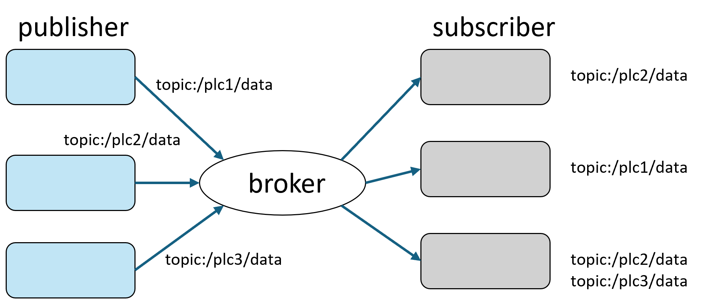
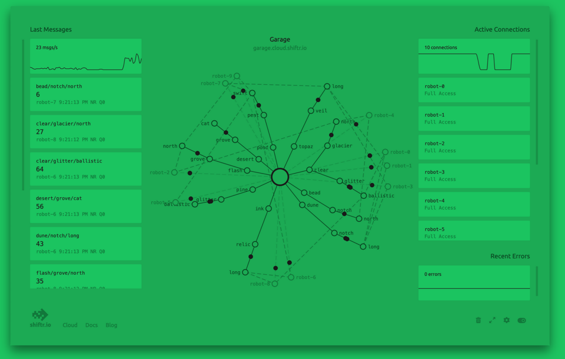
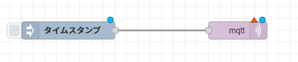
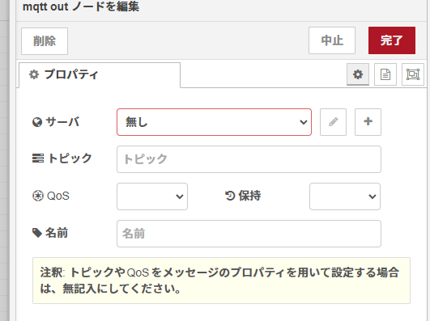
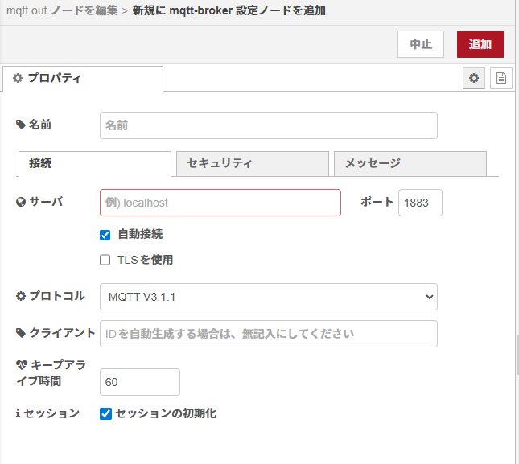
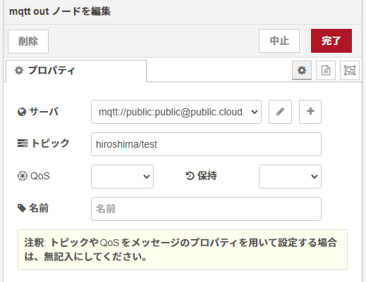
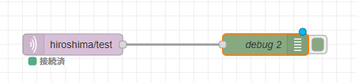
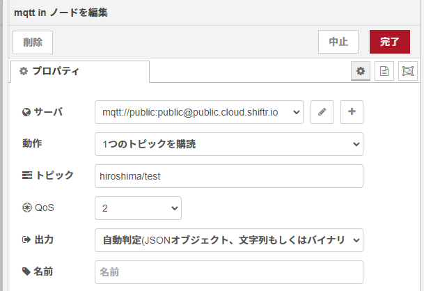

# 生産管理システム実習

これまでの node-red を用いたシステムはインターネット (世界中) からはアクセスできません。校内 LAN という限られた範囲内で有効です。これでも十分な場面もあるかと思いますが、外部にデータを公開したくなることもあると思います(node-red 自体をインターネット外部においてしまうと攻撃の対象になりやすくなってしまう)。ここではもう少し安全に考慮して許可したデータのみを外部に送る方法を紹介します。

ここからは出席番号の奇数と偶数にひとでペアで実習をします。

## chatgpt に聞いた MQTT

**MQTT（Message Queuing Telemetry Transport）**は、軽量で効率的な通信プロトコルで、特に低帯域幅や高遅延のネットワーク環境に適した設計がされています。IoT（モノのインターネット）やモバイルアプリケーションでよく利用されます。

### 主な特徴
1. **パブリッシュ/サブスクライブモデル**  
   - クライアントは特定のトピックにメッセージを**パブリッシュ（送信）**したり、そのトピックを**サブスクライブ（購読）**したりできます。
   - クライアント同士が直接通信するのではなく、**ブローカー**（サーバー）がメッセージを仲介します。
  

2. **軽量性**  
   - ヘッダー情報が少なく、データ量が最小限に抑えられるため、通信が低コストです。

3. **品質保証レベル（QoS）**  
   - 配信の信頼性を指定可能。
     - **QoS 0**: メッセージは「送信するだけ」（配送保証なし）。
     - **QoS 1**: 必ず「少なくとも1回」配信される。
     - **QoS 2**: 必ず「1回だけ」配信される。

4. **常時接続**  
   - クライアントはブローカーに対して接続を維持するため、リアルタイム性が高い。

5. **柔軟性**  
   - トピックの階層構造（例: `home/kitchen/temperature`）を使用して、通信内容を整理できます。

### 主な用途
- IoTデバイス間の通信（センサー、スマート家電など）
- リアルタイムモニタリング（温度、湿度などのデータ収集）
- チャットアプリや通知サービス

### メリットとデメリット
**メリット:**
- ネットワーク負荷が少ない
- シンプルなプロトコル設計
- リアルタイム性に優れる

**デメリット:**
- ブローカーに依存するため、シングルポイント障害（SPoF）が発生する可能性
- セキュリティ機能は組み込みでなく、TLSなどで補う必要がある

簡単に言えば、MQTTは「小さなデータを効率的に送受信するための仕組み」で、特にIoTシステムでその威力を発揮します。

## MQTT ブローカー

MQTT を利用するには **ブローカー (仲介者)** が必要です。ここでは外部のサービスを利用して、偶数の出席番号の人が publisher (データを送る人) となり、奇数の出席番号の人が subscriber (データを受け取る人) となって、データを送受信してみましょう。

### shiftr.io

https://www.shiftr.io/ はインターネット上に公開されている MQTT ブローカーです。試用であれば無料で利用できます。

1. どちらか一人が、上のアドレスにアクセスし "try" をクリック。
2. 表示された mqtt:// で始まるアドレスを記録しておく (覚えておく)

### Publisher (送信側)

Node-red には MQTT ノードが用意されているので、それを利用します。
ここでは、タイムスタンプを送ってみましょう。

以下のようにノードを配置します。

mqtt ノードをダブルクリックし、以下のように設定します。

- 最初、サーバ (ブローカー) の設定が必要です。  
\+ をクリックしてサーバを追加します。
  - サーバに先ほど try で表示されたアドレスを設定します。
- 戻ったら、トピック (話題) を設定します。  
トピックは '/' で区切ります。
ここでは、'hiroshima/test' とします。

デプロイして動作させてみましょう。

### Subscriber (受信側)

mqtt out ノードと debug ノードを接続します。

mqtt out ノードをダブルクリックし、mqtt in ノードと同じ設定をします。

- 購読しているトピックが合っていないとメッセージを受信しません。

デプロイして動作を確認してみましょう。

インターネットを経由して、送信者から受信側へメッセージ (inject ノードを変更してなければミリ秒のタイムスタンプ) が届けば成功です。

**課題５：publisher (出席番号偶数) から自分の PLC の D1 の値を MQTT に publish し、subscriber (出席番号奇数) はそれを受け取り、Dashboard 上 Guage としてに反映させてください。**
 
**課題６：トピックを 'hiroshima/test2' にして、publisher と subscriber の立場を反対にした flow を追加してください。**

- 出席番号奇数の人が D1 の値を publish する
- 出席番号偶数の人が subscribe し、Dashboard に反映する

**課題７：トピックを 'hiroshima/D121' として出席番号奇数のひとが Dashboard 上のスイッチをスライドさせると、出席番号偶数のひとの PLC のレジスタ D121 の値 (ON/OFF) が書き換わるような flow を作成してください。**
