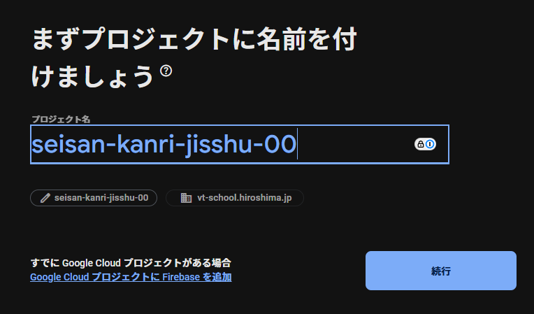

# 生産管理システム実習

## クラウドサービスへの応用

今回の演習では Firebase を利用します。

# Firebase とは
[Firebase](https://firebase.google.com) は Google 社が提供するモバイルプラットフォームです。
iOS、Android、Web等でアプリケーションを構築し、モバイルサービスを提供する際に必要な機能を備えています．主な機能として、リアルタイムデータベース、ユーザー認証、ストレージ、ホスティング、ファンクション、通知等があります。

料金プランは、無料のSpark, 従量制のBlazeの2つのプランが存在します。プランに応じて、Realtime Databaseへの同時接続数であったり、Cloud Functionsの呼び出し数やなどに制限があります。各プランの制限事項などの詳細は公式サイトの [料金](https://firebase.google.com/pricing/`)ページで確認できます。

## Firebaseによるサーバの構築

データベースには、Firebase Realtime Databasを利用します。また、今後作成するWebアプリケーションの配置先として、Firebase Hostingを利用します。利用するFirebaseの機能概要は以下のとおりです。

### Firebase Realtime Database

Firebase Realtime Databaseはクラウドホスティング型のNoSQLデータベースであり、データとしてJSONデータを保存・同期します．Realtime Database SDKを使うことでリアルタイムに保存・同期を行い、オフラインにも対応します。

### Firebase Hosting

Firebase Hostingは、SPAを簡単に公開できます。CDNやHTTPSにも対応しています。

### Firebase Authentication

Firebase Authenticationは、ユーザー認証システムを簡単に構築できます。ログインプロバイダとして、メールアドレス、電話認証、Google、Twitter、Facebook、GitHubおよび匿名があります。

# 開発環境の準備

Firebaseを用いたサーバ構築に必要な開発環境を準備します。作成するWebサーバは、FirebaseのRealtime DatabaseとHosting機能を利用します。そのための設定を行っていきます。

## Firebaseの利用開始

Firebaseを利用開始するためには、コンソールページへログインします。
ブラウザで `https://console.firebase.google.com` と入力し、Googleアカウントでログインします．

もしくは，Firebaseの[公式サイト](https://firebase.google.com)からログインします。画面の右上の「Go to console」リンクをクリックします．


## Firebaseプロジェクトの作成


新規にプロジェクトを作成します．コンソールページの中央にある、"プロジェクトを追加"リンクをクリックします．プロジェクトを追加するポップアップ画面が表示されるので、プロジェクト名、プロジェクトID、規約の同意を入力・選択していきます．



- プロジェクト名は、半角・英数・一部記号で4文字以上を入力します．
- プロジェクトIDを確認します．プロジェクトIDは、先ほど指定したプロジェクト名をベースに自動生成されます．なお、自動生成されたプロジェクトIDを変更したい場合は、鉛筆のアイコンをクリックすることで変更できます．このIDは、Realtime DatabaseやFirebase Hosting等のURLの一部となり、グローバルで一意である必要があります．画面上のヘルプ欄にもありますが、プロジェクトIDは後から変更できませんので注意が必要です．

- "続行"　をクリックします．


Google Analyticsの設定を行います．今回は、Google Analyticsを利用しないので、"Google Analyticsを設定しない" を選択します．

- "プロジェクトを作成" をクリックします．


## リアルタイムデータベースの作成

ブラウザのFirebase console上で，Realtime Databaseの項目をオープン，リアルタイムデータベースを作成します．

 
 

`データベースを作成` ボタンをクリック

### データベースを作成するロケーションを選択


`nam5 (United States)` を選択します．


### セキュリティルールの設定


今回は，`テストモード` を選択して実行します。これで準備が整いました。

# Firebase CLI のインストール

Firebase は CLI (Command Line Interface) により、Firebase のプロジェクトの管理、操作、デプロイ(公開) を行います。

## Windows

Windows は以下のアドレスから、バイナリ (実行ファイル) をダウンロードして実行します。

- https://firebase.tools/bin/win/instant/latest

ダウンロードしたバイナリを実行すると、firebase コマンドが実行可能なシェルがオープンします。

# Firebase CLI でログイン

サーバ構築にあたり、先ほど作成したFirebaseプロジェクトを利用するためにターミナルを使ってFirebaseへログインします。`fireabse` コマンドに続き `login`　と入力します．

```sh
firebase login
```

コマンドを入力するとブラウザが立ち上がり、Goolgeアカウント認証のページが表示されます。認証後、Firebase CLIのアクセスを許可します。

```sh
✔  Success! Logged in as xxx@gmail.com
```

`firebase logout` コマンドを入力するとFirebase CLIはログアウトします。

# Firebaseプロジェクトの初期化

コンソールで作成したプロジェクトに対して、Hostingの機能を利用できるようにしていきます。

ターミナルでプロジェクト用のディレクトリを作成します。今回は，plc_host 名でディレクトリを作成します。このディレクトリ内がFirebaseプロジェクトのディレクトリとなります。

```sh
mkdir plc_host
cd plc_host
```

## Hostingの設定
Firebase Hostingの設定を行います．ターミナルで `firebase init hosting` コマンドを入力します。ターミナルには、Firebaseプロジェクトが一覧に表示されるので、該当するプロジェクトを選択します。設定が終わると以下のようなディレクトリ構成になります。

```sh
firebase init hosting
```

```sh
.
├── firebase.json
└── public
    ├── 404.html
    └── index.html
```

## デプロイ (公開) 

まずはなにも変更しないで公開してみましょう。

```sh
firebase deploy
```

しばらく待ちます．デプロイが完了すると、ターミナル上に `Deploy complete!` のメッセージとともに、アドレスが表示されます．

=== Deploying to '{プロジェクトID}'...

...中略...

+ Deploy complete!

Project Console: https://console.firebase.google.com/project/xxxxx/overview
Hosting URL: https://xxxxx.web.app

表示された Hosting URL にアクセスし表示を確認します。

これは Google の運営するサーバーですから世界中のどこからでもアクセス可能です。

### index.html

index.html を以下のように変えてみます。HTML はプログラミング言語の一種です。

HTML にどんなものがあるかは、「HTML タグ」というキーワードで検索すると確認できます。
chatgpt に「自己紹介のページ例を HTML で作って」お願いしてもいいでしょう。

以下の自己紹介テンプレートは chatgpt に作成してもらいました。

```html
<!DOCTYPE html>
<html lang="ja">
<head>
    <meta charset="UTF-8">
    <meta name="viewport" content="width=device-width, initial-scale=1.0">
    <title>自己紹介</title>
    <style>
        body {
            font-family: Arial, sans-serif;
            line-height: 1.6;
            margin: 0;
            padding: 0;
            background-color: #f4f4f9;
            color: #333;
        }
        header {
            background-color: #4CAF50;
            color: white;
            padding: 1rem 0;
            text-align: center;
        }
        .container {
            max-width: 800px;
            margin: 2rem auto;
            padding: 1rem;
            background: white;
            border-radius: 8px;
            box-shadow: 0 2px 4px rgba(0, 0, 0, 0.1);
        }
        h1, h2 {
            color: #4CAF50;
        }
        ul {
            list-style: none;
            padding: 0;
        }
        ul li {
            margin: 0.5rem 0;
        }
        footer {
            text-align: center;
            margin: 2rem 0;
            font-size: 0.9rem;
            color: #666;
        }
    </style>
</head>
<body>

<header>
    <h1>自己紹介ページ</h1>
</header>

<div class="container">
    <h2>名前: 山田 太郎</h2>
    <p>こんにちは！私はソフトウェアエンジニアで、ウェブ開発とIoTが専門です。新しい技術を学ぶことが好きで、趣味は読書とハイキングです。</p>
    
    <h2>基本情報</h2>
    <ul>
        <li>出身地: 広島県</li>
        <li>現在地: 東京</li>
        <li>職業: ソフトウェアエンジニア</li>
        <li>趣味: 読書、ハイキング、プログラミング</li>
    </ul>
    
    <h2>スキル</h2>
    <ul>
        <li>プログラミング言語: Python, JavaScript, HTML/CSS</li>
        <li>フレームワーク: React, Node.js, Django</li>
        <li>ツール: Git, Docker, VS Code</li>
    </ul>
</div>

<footer>
    <p>&copy; 2025 山田 太郎. All Rights Reserved.</p>
</footer>
```

index.html に上書きしたら、デプロイします。

```sh
firebase deploy
```

### もしも表示が変わらないときは

ブラウザがページを覚えてしまっている可能性があります。
ブラウザの右上 `⋮` をクリックし、`閲覧履歴データを削除` を実行するとリセットすることができます。
