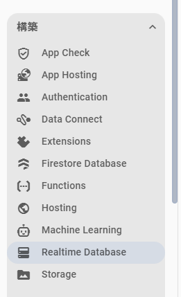
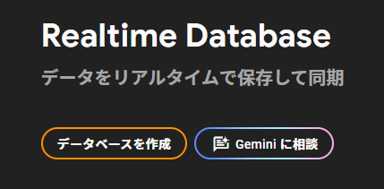
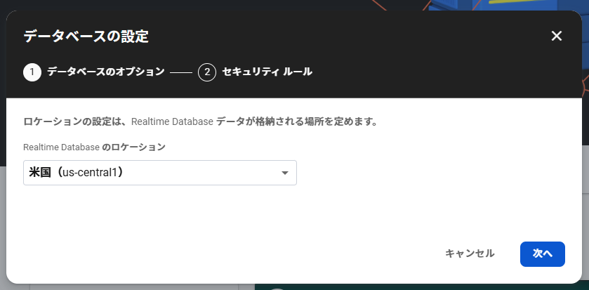
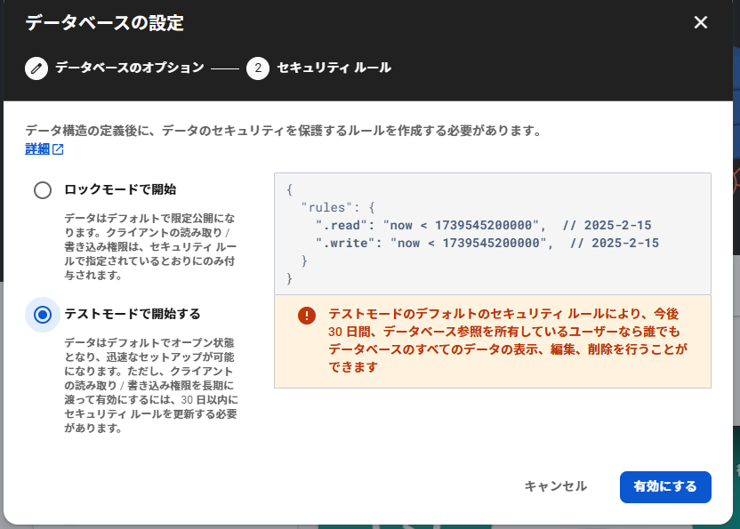
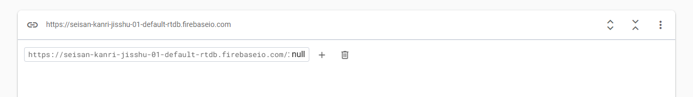
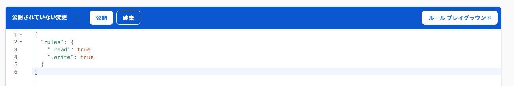
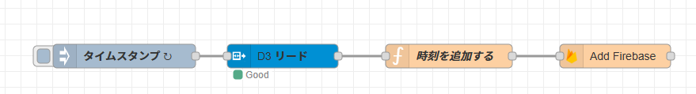

# Realtime Database

クラウドサービスにはデータベースサービスもあります。
Firebase に用意された Raltime Database サービスを使ってみましょう。

firebase のプロジェクトコンソールで画面左のメニューから「構築」→「Realtime Database」を選びます。

<center>

</center>

データベースを作成を選びます。

<center>

</center>

利用するサーバーは米国を選びます。

<center>

</center>

セキュリティルールは今回はテストなので、テストモードにします（どこからでも読み書きできる）。

<center>

</center>

## ルールの設定

どこからでも読み書き可能な設定します。

<center>

</center>

<center>

</center>

以上でデータベースができました。

# Node-red から書き込む

このデータベースに Node-red からデータを書き込んでみます。

node-red を起動し、`パレットの管理 > ノードの追加` を開き、`node-red-contrib-firebase` ノードを追加します。

## node-red の再起動

ターミナルで、`node-red-stop` を実行し、`node-red-start` で起動します。

- 停止する

```sh
$ node-red-stop
```

- 起動する
```sh
$ node-red-start
```

## Reatime Database へのデータ送信

`Add Firabase` ノードの追加

パレットから `Add Firebase` ノードを追加し、ノードの設定を行います。

1. Firebase データベース  
先ほど firebase プロジェクトでつくった Realtime Database の URL
2. Auth Type  
None (なし)
3. Child Path  
`PLCs/PLC001/D3` とします  
**PLC001 番の D3 レジスタ**、という意味
4. Method  
`push` を選択(新規追加モード)

## D3 レジスタの取得

MC PROTOCOL ノードと接続していきます。PLC から取得した D3 に時刻情報 (タイムスタンプ) を追加します。

<center>

</center>

`Function` ノードを間に挟みます。ノード内のコード欄に以下のプログラムを書き込みます。

```javascript
msg.payload.timestamp = Date.now(); // タイムスタンプを付与
return msg;
```

Node-red 右上の `デプロイ` を押して反映させます。

### 注意
**inject の周期が早いと、あっという間に無料で使えるデータ量に達してしうので、注意しましょう。**

## データの確認

[firebase クラウドサービス](http://console.firebase.google.com/)の管理画面でデータベースにデータが書き込めたか確認してみましょう。

1. プロジェクトを選択
2. 画面左の`構築` から `Realtime Database` を選択
3. `PLCs/PLC001/D3` のデータが増えていれば成功

# Web アプリケーションからアクセス

今書き込んだデータを公開している Web ページ (HTML) からアクセスできるようにします。

## Web アプリケーションを登録する

1. [firebase クラウドサービス](https://console.firebase.google.com/) にアクセスし、プロジェクトを選択します。
2. `アプリを追加`を選択します。
3. Web `</>` を選択します。
4. アプリの登録  
任意の名前を設定します。ここでは「実習アプリ」としました。  
**このアプリの Firebase Hosting も設定します。** はチェックしない
5. Firebase SDK の追加  
`<script> タグを使用する`　を選択します。
6. `コンソールに進む` を選択します。

「プロジェクトの設定」画面に Web アプリケーションが登録されます。

# index.html の変更

さきほど自己紹介テンプレートだった index.html を書き換えます。

```html
<!DOCTYPE html>
<html lang="ja">
<head>
    <meta charset="UTF-8">
    <meta name="viewport" content="width=device-width, initial-scale=1.0">
    <title>リアルタイムデータ</title>
    <style>
        body {
            font-family: Arial, sans-serif;
            margin: 20px;
            background-color: #f4f4f9;
        }
        h1 {
            color: #4CAF50;
        }
        canvas {
            max-width: 100%;
            height: 400px;
        }
        #dataList {
            margin-top: 20px;
            padding: 10px;
            background: white;
            border-radius: 8px;
            box-shadow: 0 2px 4px rgba(0, 0, 0, 0.1);
        }
        ul {
            list-style: none;
            padding: 0;
        }
        li {
            padding: 5px 0;
            border-bottom: 1px solid #ddd;
        }
        li:last-child {
            border-bottom: none;
        }
    </style>
</head>
<body>
    <h1>リアルタイムデータグラフとリスト</h1>
    <canvas id="realtimeChart"></canvas>
    <div id="dataList">
        <h2>データ一覧</h2>
        <ul id="dataItems"></ul>
    </div>
    <script src="https://cdn.jsdelivr.net/npm/chart.js"></script>
    <script src="https://cdn.jsdelivr.net/npm/chartjs-adapter-date-fns"></script>
    <!-- 外部JSファイルを読み込む -->
    <script src="app.js" type="module"></script>
</body>
</html>
```

おなじフォルダに app.js というファイルを作ります。

```javascript
import { initializeApp } from "https://www.gstatic.com/firebasejs/11.1.0/firebase-app.js";
import { getDatabase, ref, onValue } from "https://www.gstatic.com/firebasejs/11.1.0/firebase-database.js";

//
// Firebaseの設定
// 自分のプロジェクトのコンフィグにしてください
//
const firebaseConfig = {
    apiKey: "",
    authDomain: "",
    databaseURL: "",
    projectId: "",
    storageBucket: "",
    messagingSenderId: "",
    appId: "",
};

const app = initializeApp(firebaseConfig);
const database = getDatabase(app);
const path = "/PLCs/PLC001/D3";
const dbRef = ref(database, path);

const ctx = document.getElementById('realtimeChart').getContext('2d');
const chart = new Chart(ctx, {
    type: 'line',
    data: {
        labels: [], // X軸: タイムスタンプ
        datasets: [{
            label: 'D3の値',
            data: [], // Y軸: D3の値
            borderColor: 'rgba(75, 192, 192, 1)',
            backgroundColor: 'rgba(75, 192, 192, 0.2)',
            tension: 0,
            fill: false,
        }]
    },
    options: {
        responsive: true,
        scales: {
            x: {
                type: 'time',
                time: {
                    unit: 'second'
                },
                title: {
                    display: true,
                    text: '時間'
                }
            },
            y: {
                title: {
                    display: true,
                    text: 'D3の値'
                }
            }
        }
    }
});

function updateDataList(timestamp, value) {
    const dataList = document.getElementById('dataItems');
    const listItem = document.createElement('li');
    const formattedTime = new Date(timestamp).toLocaleString();
    listItem.textContent = `時間: ${formattedTime}, D3の値: ${value}`;
    dataList.prepend(listItem);

    while (dataList.children.length > 20) {
        dataList.removeChild(dataList.lastChild);
    }
}

onValue(dbRef, (snapshot) => {
    if (snapshot.exists()) {
        const data = snapshot.val();
        Object.values(data).forEach(entry => {
            const timestamp = entry.timestamp;
            const d3Value = entry.D3;

            chart.data.labels.push(new Date(timestamp));
            chart.data.datasets[0].data.push(d3Value);

            if (chart.data.labels.length > 50) {
                chart.data.labels.shift();
                chart.data.datasets[0].data.shift();
            }

            chart.update();
            updateDataList(timestamp, d3Value);
        });
    } else {
        console.log("データがありません。");
    }
}, (error) => {
    console.error("データの読み込みエラー:", error);
});
```

ファイルの配置は以下のようになります。
- public フォルダの下に 404.html と index.html と app.js がある

```sh
plc_host
|-- firebase.json
`-- public
    |-- 404.html
    |-- app.js
    `-- index.html
```    

できたら deploy します。

```sh
$ cd ..
$ firebase deploy
```

deploy できたらブラウザでアクセスし、動作を確認してみましょう。
新しいデータを受信するとページが更新されます。

### もしも表示が変わらないときは

ブラウザがページを覚えてしまっている可能性があります。
ブラウザの右上 `⋮` をクリックし、`閲覧履歴データを削除` を実行するとリセットすることができます。
