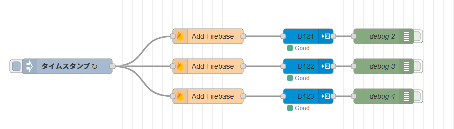

# Firebase との連携２

最後に Realtime Database と連携して、レジスタ D121, D122, D123 の ON/OFF 状態を変更します。

## Realtime database へ D121, D122, D123 の状態を保存する

`Add Firebase` を使います。

Node-Red 側では定期的に Realtime Database のデータを読み取り PLC に反映するフローを作ります。

<center>

</center>

`inject` ノードは
- 1 秒おきの繰り返し、とします

`Add Firebase` ノードは

- 接続先データベース  
  自分のデータベースのアドレス
- データがあるパス  
  /PLCs/PLC001/D121
- メソッド  
  取得する get()

  を設定します

`MC WRITE` ノードは

- Connection  
書き込む PLC のアドレス
- Address  
  D121 や D122 など適切なレジスタアドレス
- Data  
  受信した msg.payload 

を設定します。

## Web アプリケーションの変更

さきほどとおなじように、index.html と app.js というファイルを上書きします。

- index.html

```html
<!DOCTYPE html>
<html lang="en">
<head>
    <meta charset="UTF-8">
    <meta name="viewport" content="width=device-width, initial-scale=1.0">
    <title>Realtime Chart</title>
    <script type="module" src="app.js"></script>
    <script src="https://cdn.jsdelivr.net/npm/chart.js"></script>
    <style>
        .button-group {
            margin-bottom: 20px;
        }
        .button-label {
            margin-left: 10px;
        }
    </style>
</head>
<body>
    <div class="button-group">
        <button id="button-d121">D121</button>
        <span id="label-d121" class="button-label">OFF</span>

        <button id="button-d122">D122</button>
        <span id="label-d122" class="button-label">OFF</span>

        <button id="button-d123">D123</button>
        <span id="label-d123" class="button-label">OFF</span>
    </div>
    <canvas id="myChart" width="400" height="200"></canvas>
    <ul id="dataList"></ul>
</body>
</html>
```

- app.js
 - firebaseConfig は自分のデータベースの設定に合わせてください

```javascript
import { initializeApp } from "https://www.gstatic.com/firebasejs/11.1.0/firebase-app.js";
import { getDatabase, ref, set, onValue } from "https://www.gstatic.com/firebasejs/11.1.0/firebase-database.js";
import 'https://cdn.jsdelivr.net/npm/chart.js'; // Chart.jsの読み込み
import 'https://cdn.jsdelivr.net/npm/chartjs-adapter-date-fns'; // Date adapterをインポート

// Firebaseの設定
const firebaseConfig = {
    apiKey: "ここを",
    authDomain: "自分の",
    databaseURL: "データベース設定に",
    projectId: "合わせる",
    storageBucket: "",
    messagingSenderId: "",
    appId: "",
};

// Firebase初期化
const app = initializeApp(firebaseConfig);
const database = getDatabase(app);

// ボタンと状態表示をセットアップ
const setupToggleButton = (id, path, labelId) => {
    const button = document.getElementById(id);
    const label = document.getElementById(labelId);
    let currentState = false; // 初期状態

    // 初期値をデータベースから取得
    const dbRef = ref(database, path);
    onValue(dbRef, (snapshot) => {
        if (snapshot.exists()) {
            currentState = snapshot.val();
            label.textContent = currentState ? "ON" : "OFF";
        }
    });

    // ボタンクリックでトグル処理
    button.addEventListener("click", () => {
        currentState = !currentState;
        set(dbRef, currentState); // データベースに保存
    });
};

// 各ボタンの初期化
setupToggleButton("button-d121", "PLCs/PLC001/D121", "label-d121");
setupToggleButton("button-d122", "PLCs/PLC001/D122", "label-d122");
setupToggleButton("button-d123", "PLCs/PLC001/D123", "label-d123");

// グラフの初期化
const ctx = document.getElementById("myChart").getContext("2d");
const chart = new Chart(ctx, {
    type: "line",
    data: {
        labels: [],
        datasets: [{
            label: "D3 Value",
            data: [],
            borderColor: "rgba(75, 192, 192, 1)",
            tension: 0.1,
        }],
    },
    options: {
        responsive: true,
        scales: {
            x: {
                type: "time", // 時間軸を使用
                time: {
                    unit: "second", // 秒単位で表示
                },
            },
            y: { beginAtZero: true },
        },
    },
});

// データのリアルタイム取得と処理（最新20件に制限）
const dbRef = ref(database, "PLCs/PLC001/D3");
const MAX_DATA_POINTS = 20; // 最大データ数

onValue(dbRef, (snapshot) => {
    const dataList = document.getElementById("dataList");
    if (snapshot.exists()) {
        const data = snapshot.val();
        console.log("Data:", data);

        // データを配列に変換して timestamp でソート
        const sortedData = Object.entries(data)
            .map(([key, value]) => ({ key, ...value })) // オブジェクト形式に変換
            .sort((a, b) => a.timestamp - b.timestamp); // timestamp で昇順ソート

        // 最新20件のデータを取得
        const limitedData = sortedData.slice(-MAX_DATA_POINTS);

        // グラフとリストをクリア
        chart.data.labels = [];
        chart.data.datasets[0].data = [];
        dataList.innerHTML = "";

        // 最新20件のデータをグラフとリストに追加
        limitedData.forEach(({ key, timestamp, D3 }) => {
            const date = new Date(timestamp);

            // グラフ更新
            chart.data.labels.push(date);
            chart.data.datasets[0].data.push(D3);

            // リスト更新
            const listItem = document.createElement("li");
            listItem.textContent = `Key: ${key}, Timestamp: ${date}, D3: ${D3}`;
            dataList.appendChild(listItem);
        });

        chart.update();
    } else {
        console.log("No data available");
    }
});
```

deploy をします。

```
$ firebase deploy
```

`Hosting URL` に表示されているアドレスにアクセスしボタンを操作すると PLC に反映されることを確認してください。
ちなみにこれはスマホからでもできます。

### もしも表示が変わらないときは

ブラウザがページを覚えてしまっている可能性があります。
ブラウザの右上 `⋮` をクリックし、`閲覧履歴データを削除` を実行するとリセットすることができます。
