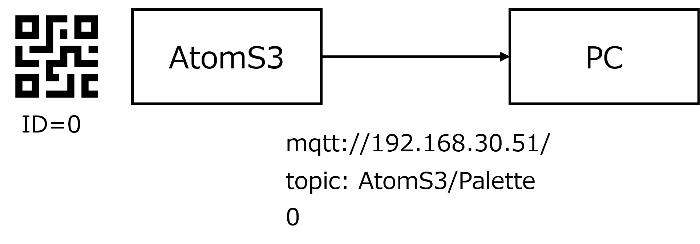
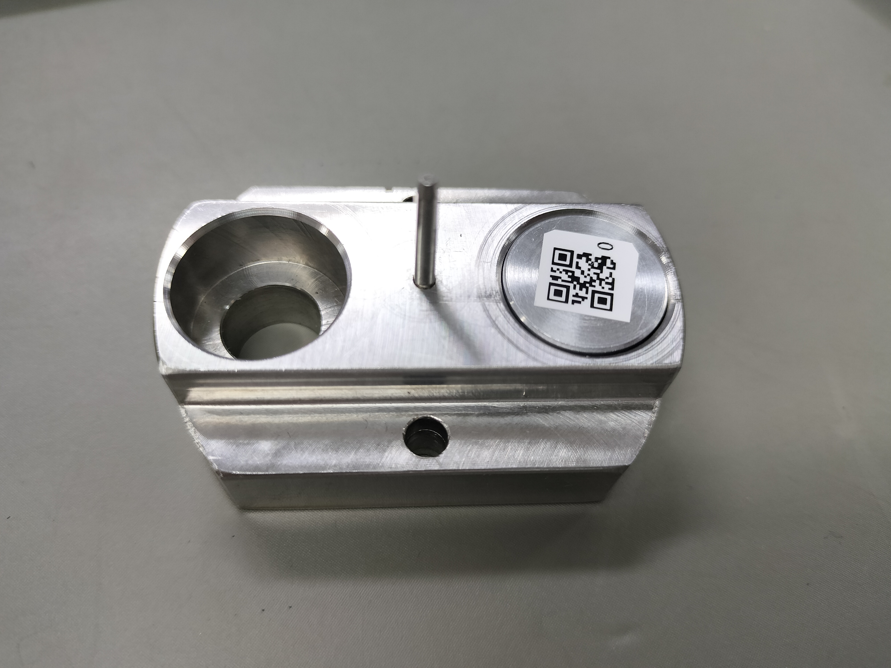
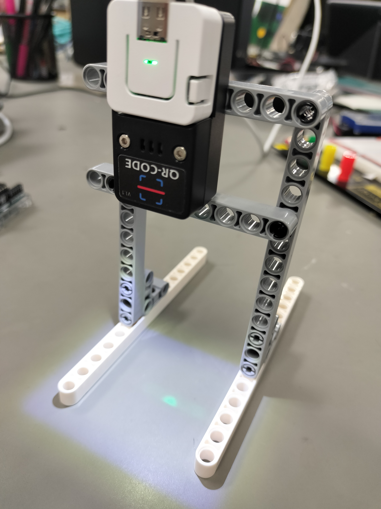

# 生産管理システム実習演習

Ａ棟に構築されている製造ラインを使って、以下の情報を取得し管理できるシステムを作成してください。

- 三班（２人１組）で作業する
- 最後の時間 (3/14 登校最終日！) に各班ごとシステムについて発表する（15分程度）
- それまでに発表用スライドも作成する
  - どのようなシステムか
  - 実際に取得したデータについての考察
  - 今後の課題  など

# 協働ロボットライン演習

以下の機能を Raspberry Pi (Node-red) を使って、ネットワークを介して GUI から指示および情報収集できるようにしてください。

1. ワークの生産個数を指示できること (連続運転モード)
2. 各ステーションで加工に要した時間を測定できること
3. 2.について、生産個数の分のデータを集め、各ステーションごとに要した時間の平均値、標準偏差を求めること
4. 一時停止 (緊急停止) した場合には MQTT ブローカーに一時停止を示すメッセージを送り、Raspberry Pi ではそれを警告として GUI 表示すること
  (MQTT の topic は任意に決めてよい)
5. 文末の「ID 読み取りシステム」から topic `AtomS3/Palette` をサブスクライブ (受信) し、（その ID を生産ロット番号とみなして）10 個の ID がいつ製造ラインを通過したのか記録し、GUI 上に表示できること
6. 5 と同様の内容 (ロット番号と通過時刻の記録) を CSV ファイルとして Raspberry Pi 上に保存すること
  ファイル名は任意に決めてよい
7. 各自で Node-red (Raspberry Pi) を使ってオリジナルな機能をつけてよい  
   ラズパイにカメラをつけてラインを監視する　など

### 参考： CSV ノードについて

Node-Red には CSV ファイルを作るノード `CSV ノード` があります。それを利用してください。

- Node-Red クックブック  
  - https://cookbook.nodered.jp/basic/generate-csv
- https://tibbo-pi.co-works.co.jp/blog/node-red%E3%81%A7%E6%B8%A9%E5%BA%A6%E3%81%AA%E3%81%A9%E3%81%AE%E6%99%82%E7%B3%BB%E5%88%97%E3%83%87%E3%83%BC%E3%82%BF%E3%82%92csv%E3%83%95%E3%82%A1%E3%82%A4%E3%83%AB%E3%81%AB%E4%BF%9D%E5%AD%98%E3%81%99/

# ワーク判別システム演習

以下の機能を Raspberry Pi (Node-red) を使って、ネットワークを介して GUI から指示および情報収集できるようにしてください。

1. 設定個数を指示できること (連続運転モード)
2. 良品 (基準値 ±1mm 未満) の数をカウントし、リアルタイムに Node-Red で表示できること
3. 不良品 (基準値 ±1mm 未満) の数をカウントし、リアルタイムに Node-Red で表示できること
4. 設定個数分における良品の実測値の平均値、標準偏差を表示できること
5. 設定個数分における不良品の実測値の平均値、標準偏差を表示できること
6. 設定個数分における良品の実測値をグラフ化すること (ダッシュボード (GUI) 上に表示してもよいし、CSV ファイルにしてエクセルで表示でもよい)
7. 設定個数分における不良品の実測値をグラフ化すること (ダッシュボード (GUI) 上にCSV ファイルにしてエクセルで表示でもよい)
8. 各自で Node-red (Raspberry Pi) を使ってオリジナルな機能をつけてよい  
   ラズパイにカメラをつけてラインを監視する　など
 
# 補足 ID 読み取りマイコンについて

設置した ID 読み取りマイコン (QR コードリーダ) は、ワークのベースに取り付けられた ID (0~9 の 10 種類あります) を読み取ると、その ID を `mqtt://192.168.30.51/` の topic `AtomS3/Palette` にパブリッシュ (送信) します。 

この topic をサブスクライブ (受信) してください。
 

読み取った ID (QR コード) を MQTT に送信

 
 

QR コードを取り付けたワークのベース

 
 

QR コードリーダー

